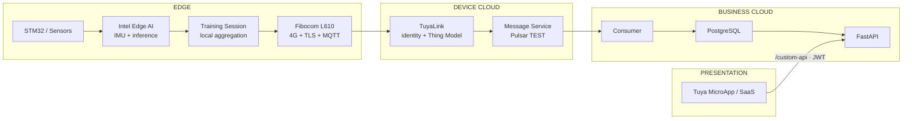

# Final System Architecture

## End-to-end view

## Responsibilities

| Layer | Owns | Does not own |
|---|---|---|
| Edge | 高频 IMU、AI inference、reps/angles/confidence/actions/faults、Session 汇总 | 用户账号、历史数据库、展示 |
| L610 / Tuya Device Cloud | 蜂窝链路、设备身份、TLS/MQTT、Thing Model、消息转发 | 高频计算、业务用户 |
| Business Cloud | Pulsar 消费、原始消息、幂等、设备归属、训练历史、报告 API | DeviceSecret、前端视觉 |
| Presentation | 登录、Dashboard、设备、历史、报告、比赛展示 | 直接访问 PostgreSQL/Tuya Secret |

## Data rate boundary

训练期间的 IMU 与逐帧推理只在 Intel 本地处理。`action_confidence` 仅用于调试或可选低频状态；默认不得逐帧上云。Session 结束产生一个 `TrainingSummary`，通过一条完整 Property Report 上报。

## Identity boundary

- Tuya DeviceID / DeviceSecret：设备云身份，仅 Edge/Tuya 边界使用。
- Business user / JWT：FastAPI 业务身份。
- `user_devices`：两种身份的受控映射。
- SaaS 永远不持有 Tuya Access Secret、DeviceSecret 或数据库凭证。

